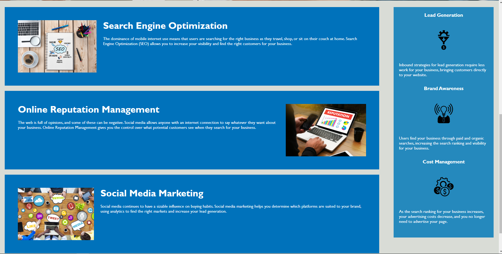

# Code Refactor Starter Code - COMPLETED

## In this challenge, I completed the following:
### - Viewed source code and sorted all semantic HTML elements to follow a logical structure.
### - Made all links function correctly.
### - Corrected all `<alt>` tags.
### - Consolidated the CSS styling elements into an organized and semantic structure
### - Deployed this project to a live GitHub URL.
## __Repository URL__: https://thor40.github.io/HoriSEOn_SSS/
## ***Screen Shots***
#### 
#### 
#### 
